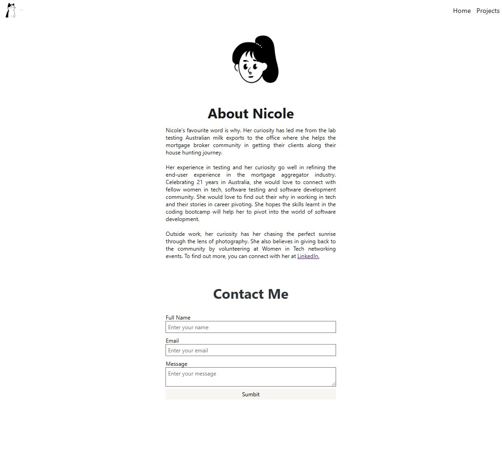
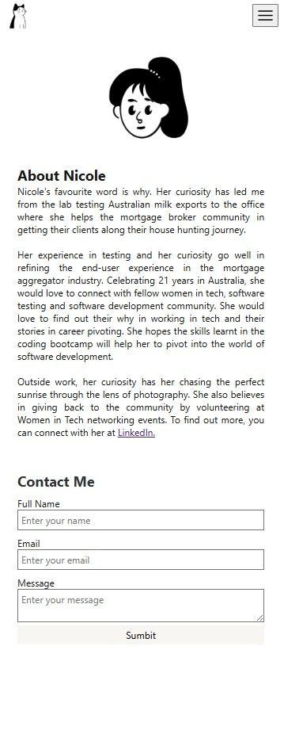
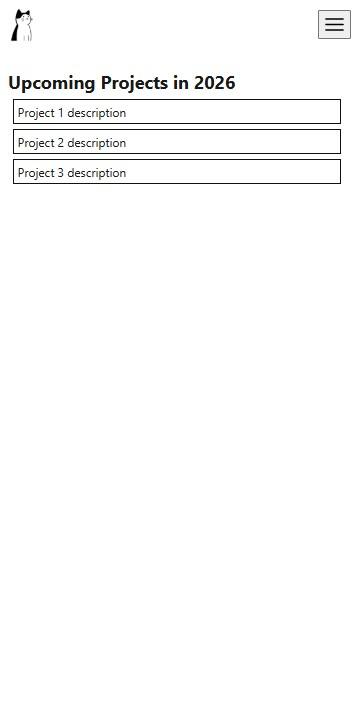
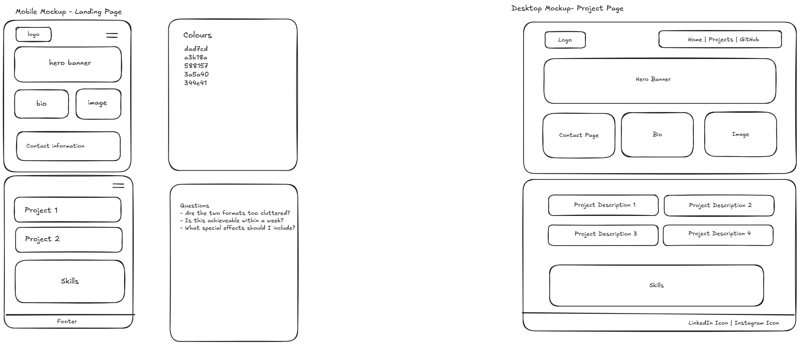

#  Nicole Chan - Portfolio Task
​
[My portfolio site](https://nictsc.github.io/)
​
## Project Requirements

### Content
 Add a short paragraph describing the features below. What aesthetic and technical choices did you make? 
- [x] At least one profile picture
- [x] Biography (at least 100 words)
- [x] Functional Contact Form
- [x] "Projects" section
- [x] Links to external sites, e.g. GitHub and LinkedIn.
- Main inspiration - Using the Notion interface as the main source of inspiration. Hence using black and white as the main colour themes, notion-like fonts and minimalism to make the website more accessible for the end-user.
​
### Technical
 Add a short paragraph describing the features below. What strategies or design decisions did you work from? 
- [x] At least 2 web pages.
- [x] Version controlled with Git
- [x] Deployed on GitHub pages.
- [x] Implements responsive design principles.
- [x] Uses semantic HTML.
- Added 2 pages (home page and project page). Using semantic HTML to differentiate different UI elements on the front end. Use mobile responsivenss principles on the behaviour and appearance of the nav bar and the hamburger menu.

### Bonus (optional)
 Add a short paragraph describing the features below, if you included any. 
- [ ] Different styles for active, hover and focus states.
- [ ] Include JavaScript to add some dynamic elements to your site. (Extra tricky!)
​
### Screenshots
> Please include the following:
> - The different pages and features of your website on mobile, tablet and desktop screen sizes (multiple screenshots per page and screen size).
> - The different features of your site, e.g. if you have hover states, take a screenshot that shows that.  
> 
> You can do this by saving the images in a folder in your repo, and including them in your readme document with the following Markdown code: 

####  Desktop Screenshots

####  Mobile Screenshots

####  Wireframe
